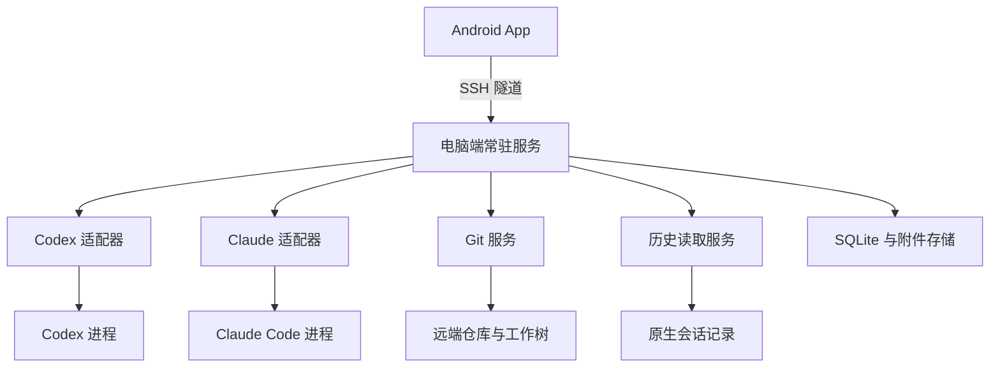

# Android SSH Agent 工作台“掌舵 · AgentDeck”：产品与技术实施方案

版本：1.3 — Android / Codex 实施范围
日期：2026-09-30
文档用途：产品范围确认、技术验证、开发拆分和验收依据。  
实施状态：Android/Codex 工作台已实现，模拟器到 Mac 的真实 SSH、Codex API 和 Git 链路已验证。具体功能和剩余验收以 [实施路线](docs/roadmap.md) 与 [验证记录](docs/validation/codex-workbench.md) 为准。本文保留完整产品规划，未落地的建议不代表已实现。

## 1. 产品定义

开发一个运行在 Android 手机上的 Agent 工作台，通过 SSH 直接连接用户已有的多台电脑，操作电脑上的 Codex、Claude Code 等 Agent。用户可以发送文字、语音和图片，查看执行进度、处理审批、阅读历史、恢复会话，并在任务完成或需要介入时收到通知。

在每个项目中集成类似 VS Code Source Control 的 **Changes 与 Graph**：查看当前修改文件、逐文件 Diff、历史提交、分支及合并关系，明确知道目前尚未提交什么、已有多少提交，以及当前分支相对上游的状态。

后续接入 Even Realities G2，将其作为手机工作台的语音输入和简短状态显示端。手机与眼镜共用会话和任务状态。

### 1.1 已确定的产品约束

| 编号 | 约束 | 设计含义 |
| --- | --- | --- |
| C01 | 手机与目标电脑之间的业务通信全部通过 SSH | 指令、事件、历史、附件、Git 数据都走现有 SSH 端口 |
| C02 | 已有可访问的 IP 和 SSH 端口 | 不要求新增公网端口、VPN 或中转服务 |
| C03 | Android 是首个客户端平台 | 优先保证 Android 使用体验和后台行为 |
| C04 | 支持多台电脑 | 每台电脑独立运行；手机负责聚合 |
| C05 | Agent 在目标电脑执行 | 项目、工具环境和模型认证保留在电脑端 |
| C06 | 手机断线不应终止由服务管理的任务 | 电脑端执行进程独立于手机连接 |
| C07 | 支持原有历史 | 发现和读取用户已有会话，不只显示 App 新建会话 |
| C08 | 具有 Changes 和 Graph | Git 阅读能力进入首个完整可用版本 |
| C09 | 支持文字、语音和图片 | 各种输入最终绑定明确的主机和会话 |
| C10 | 预留 G2 接口 | 早期验证接入条件，后期完善眼镜交互 |
| C11 | 支持 SSH 公钥认证（密钥对登录） | 手机生成 Ed25519 密钥对并提供公钥导出，用户配置目标账号，手机选择密钥登录 |

### 1.2 通信范围

“全部通过 SSH”指手机与目标电脑之间的业务数据传输。隧道内部可以使用 HTTP、SSE 或其他结构化协议；它们不会要求另开公网端口。

电脑上的 Agent 仍可能访问其模型服务、软件仓库和其他工具。手机与 G2 之间使用蓝牙。应用安装、更新及 Even 官方应用自身所需的网络访问不等于 Agent 业务通道。若后续要求整个系统完全离线，需要另行选择本地模型，并验证语音识别和眼镜平台的离线条件。

### 1.3 首版范围

首个完整可用版本覆盖：多主机、SSH 密码与密钥登录、Codex 与 Claude Code、已有历史、受管理任务、审批、断线恢复、通知、文字／图片／按键语音，以及只读 Git Changes／Graph。

本轮按用户最新决定先完成 Android + Codex，使用模拟器连接当前 Mac，沿用电脑已有 API 配置；Claude Code 稍后接入，G2 在具备设备后联调。物理手机、Linux 和 Windows 分别验收，不从当前组合外推。

## 2. 典型使用流程

### 2.1 从手机发起任务

1. 选择电脑、项目和 Agent。
2. 新建会话或恢复一个已停止的历史会话。
3. 输入任务，可附图片或录音转写文字。
4. 查看回复、计划、命令输出和文件变更。
5. 如遇审批或问题，在手机处理。
6. 切换到 Changes 查看实际工作区改动；打开 Graph 查看提交。
7. 离开 App 后，由电脑继续执行；手机在连接可用时收到完成或待处理通知。

### 2.2 查看原有电脑会话

连接后自动发现所选账号和 Agent 数据目录下的会话，按项目、Agent 和时间筛选。打开历史不应自动启动 Agent，也不应修改原始记录。只有用户发送新消息或选择恢复，才进入执行流程。

### 2.3 电脑与手机交替使用

对本服务管理的会话，可通过配套终端入口重新附着。对其他终端独立启动的会话，先提供读取和跟随；是否能直接控制，由 Agent 接口和运行版本决定。不能通过重复启动同一 session 来模拟无缝接管。

### 2.4 离线查看

手机可阅读已经缓存的消息和 Git 快照，并显示最后同步时间。未加载的历史不能假装已缓存。离线输入先保存为草稿；需要排队发送时，界面明确显示“未送达”，重新连接后按提交策略处理。

## 3. 参考项目与复用策略

### 3.1 调研结果

用户提到的 HappyDEV／Happyer 暂对应下表中的 Happy／Happier。CC Sessions 存在同名项目，本方案采用支持多种 Agent 和 SSH 环境的 `ccpopy/cc-sessions` 作为主要参考。

| 项目 | 参考价值 | 使用方式 |
| --- | --- | --- |
| [Happy](https://github.com/slopus/happy) | 手机交互、工具事件、审批、同步机制；提供自托管版本 | 参考产品流程，评估独立模块 |
| [Happier](https://github.com/happier-dev/happier) | 原生历史发现、直接跟随、接管、历史分页、待处理事项 | 重点参考历史与执行归属设计 |
| [HAPI](https://github.com/tiann/hapi) | Runner／Hub、REST＋SSE、原生 Android、审批和恢复 | 重点参考服务端生命周期与客户端事件模型 |
| [CC Sessions](https://github.com/ccpopy/cc-sessions) | 原生会话浏览、搜索、分支、迁移与格式处理 | 参考兼容层，首版优先只读 |
| [Sessions Viewer](https://github.com/jerrywu001/cc-sessions-viewer) | 历史与实时聊天融合，工具调用和文件变化展示 | 参考阅读体验 |
| [Codex Remote Android](https://github.com/liuhao-labs/codex-remote-android) | Android 经 SSH 连接 Codex、发现历史、主机指纹验证 | 优先评估 Android 基础代码复用 |
| [Agmente](https://github.com/rebornix/Agmente) | ACP 与 Codex App Server 双适配 | 参考多协议能力设计 |
| [Whip](https://github.com/kosumic/whip) | Agent 导向的 SSH 客户端、主机与待处理队列 | 参考界面组织，关注其 Herdr 依赖 |

上述是项目文档及局部源码所体现的能力，不构成对稳定性、覆盖率或发布版本的实测结论。候选仓库变化较快，开发开始时记录采用的分支、commit、许可证和依赖版本。[R1–R8]

### 3.2 推荐复用边界

优先复用 SSH 连接、聊天渲染、结构化消息解析和历史读取经验。任务持久化、逐主机连接、后台通知策略、Git 聚合和 G2 桥接要按本产品的约束重新组织。

不把现成平台的中心同步服务器设为必需依赖。Happy／Happier／HAPI 可以自托管，但“可自托管”不等于“无需任何客户端连接和部署改造”。

候选底座先比较两条路线：

| 路线 | 优点 | 主要代价 | 当前判断 |
| --- | --- | --- | --- |
| 复用 Codex Remote Android，增加自己的电脑服务 | 与 SSH、Android 和 Codex 目标接近 | 需要抽象 Claude、增加任务持久化和 Git | 优先验证 |
| 复用 HAPI 的 Android 与更多服务组件 | 多 Agent、审批和数据模型较完整 | 需要改造逐主机部署、连接、推送和部分产品范围 | 保留为备选 |

最终选择以可编译性、改造工作量和断线测试为依据。引用或复制代码时保留许可证和必要声明，分别检查依赖；不沿用上游产品的官方身份或品牌暗示。

## 4. 总体架构

每台目标电脑各运行一个当前用户权限下的常驻服务。手机分别建立 SSH 连接，并将会话和待处理事项聚合显示。电脑之间不需要互相连通。

图中电脑端部分在各台电脑独立部署。G2 通过手机接入，见第 12 节。

### 4.1 手机端模块

| 模块 | 职责 |
| --- | --- |
| 主机管理 | IP、端口、用户名、密码／密钥认证、密钥创建与选择、公钥复制／分享／导出、主机指纹、连接诊断 |
| SSH 传输 | 握手、隧道、心跳、重连、SFTP |
| 会话管理 | 主机／项目／Agent 筛选、历史、恢复、收藏 |
| 聊天与执行界面 | 文字、工具卡片、审批、问题、进度、取消 |
| Git 界面 | Changes、Diff、Graph、提交详情、计数 |
| 输入与附件 | 相机、相册、录音、转写、上传状态 |
| 本地缓存 | 最近历史、Git 快照、草稿、同步游标 |
| 通知 | 完成、失败、审批和问题；去重与跳转 |
| 眼镜桥接 | 状态摘要、目标会话、语音和受限操作 |

### 4.2 电脑端模块

| 模块 | 职责 |
| --- | --- |
| 常驻服务与执行协调 | 持有进程，启动／恢复／取消，确认执行归属 |
| Agent 适配器 | 翻译请求和事件，声明支持能力 |
| 历史服务 | 原生会话发现、分页、只读兼容、搜索 |
| 事件存储 | 事件序号、状态投影、重放和快照 |
| 审批协调 | 审批 ID、执行代次、有效期和已解决状态 |
| Git 服务 | 仓库发现、状态、Diff、提交 DAG 和统计 |
| 附件服务 | 上传、校验、暂存、访问范围及清理 |
| 诊断与版本 | 主机信息、协议能力、依赖版本、可导出诊断 |

## 5. SSH 通信与部署

### 5.1 推荐通信路径

电脑服务只监听 `127.0.0.1` 上的本地端口。手机经现有 SSH 端口转发到该地址，以 REST 提交操作，以 SSE 接收事件。SFTP 作为文件传输的可选实现。

电脑服务内部通过 stdio 连接 Codex App Server。此设计不依赖 Codex 自身的实验性 WebSocket 传输。[R9]

手机本地转发端口同样只绑定 loopback。隧道入口和电脑端服务仍使用独立、可撤销的应用认证，避免把“本机地址”误当成任何本地应用都可信。

如果服务端禁止端口转发，后备方案是 SSH exec 固定桥接命令，经 stdio 接到常驻服务的本地 IPC。不能因此退回到公开 App Server 端口。

### 5.2 连接过程

1. 验证 SSH 主机指纹，首次连接供用户核对，变化时阻止静默继续。
2. 使用该主机选定的密码或密钥认证当前用户，密钥登录流程见第 5.4 节。认证成功后检测平台、服务和 Agent 版本。
3. 建立隧道或 stdio 桥接，完成应用层认证及能力协商。
4. 拉取当前主机快照和最后游标之后的事件。
5. 展示可用项目、会话、待处理项和服务状态。

首次安装服务应显示将安装的版本、路径和启动方式，再由用户发起安装。日常连接不强制静默升级。Linux 优先使用用户服务；是否需要 linger 等配置，在实际登录／退出行为验证后确定。Windows 和 macOS 分别验证服务、登录环境、PATH、凭据访问与休眠行为。

### 5.3 多主机和重连

每个主机通常保持一个 SSH 连接，内部复用逻辑通道。主机在线时使用一个主机级事件流，避免每个会话各开一条持续连接。大附件传输要限速，不能长时间阻塞审批消息。

区分“SSH 可达”“服务可达”“Agent 可用”“会话执行中”。一台机器断线只影响该机器；其他连接继续工作。重连采用带随机抖动的退避，检测到 Wi-Fi／移动网络变化后重新建立传输。

### 5.4 SSH 密钥登录

主机设置提供“密码登录”和“密钥登录”两种认证方式。密码登录使用目标电脑的用户名和密码；密钥登录使用手机保存的私钥和目标账号已授权的对应公钥。手机通过私钥完成签名认证，私钥保留在手机端。[R23]

#### 手机创建密钥并登录

1. 用户在密钥管理中点击“创建密钥”，填写名称，App 在手机本地生成 Ed25519 公钥／私钥对。
2. App 保存私钥，展示对应的 OpenSSH 单行公钥，提供复制、分享和导出 `.pub` 文件入口。
3. 用户自行将公钥配置到目标电脑的登录账号。公钥的传递方式和电脑端配置由用户处理；App 负责提供可用的公钥内容。
4. 用户添加主机，填写 IP、SSH 端口和用户名，选择“密钥登录”及刚创建的密钥。
5. 点击“测试连接”，完成服务器身份核验和用户认证，展示 SSH 登录结果。电脑服务是否可用单独显示。认证成功后即可使用 SSH 连接。

同一密钥可关联多台主机，每台主机保存明确的密钥选择。选择“密码登录”时使用账号密码认证；选择“密钥登录”时使用选定密钥认证。密钥列表提供创建、重命名、查看／复制／分享／导出公钥和删除入口。

#### 手机存储与重连

手机生成的私钥保存到应用私有存储，由 Android Keystore 管理的密钥加密保护，App 自动完成本地读取和解密。用户选择密钥即可登录。主机记录保存密钥 ID，密钥内容由手机凭据存储管理。

网络恢复或 App 进程重启后，使用已保存的密钥重新认证。认证失败时暂停该主机的自动重试，提示用户检查用户名、所选密钥和远端公钥配置；网络故障继续按第 5.3 节的连接策略处理。电脑端受管理任务的生命周期独立于手机连接。

删除密钥时列出引用它的主机；确认后删除本地私钥及相关密钥记录、解除主机关联，并关闭使用该密钥的本地 SSH 连接。主机配置保留，下一次连接需重新选择密钥。删除手机密钥不会撤销电脑端的公钥授权；撤销授权由用户在目标账号配置中完成。

#### 技术验证

阶段 0 验证手机本地 Ed25519 生成、OpenSSH 公钥格式、私钥加密保存和读取、SSH 签名认证，以及进程重启后的再次登录。使用同一目标账号分别验证密码和密钥登录。界面区分网络不可达、主机身份变化和用户认证失败；服务器未提供具体原因时给出检查方向。

## 6. 会话和执行模型

### 6.1 四种能力

| 能力 | 定义 | 首版策略 |
| --- | --- | --- |
| 浏览 | 读取已有历史 | 必须支持 |
| 跟随 | 读取正在变化的历史或事件 | 支持；无可靠运行信息时明确为观察状态 |
| 恢复 | 根据原生 ID 和环境重新进入历史上下文 | 支持已停止且兼容的会话 |
| 附着／接管 | 控制现有执行进程 | 先支持本服务管理的执行；其他情况按能力开放 |

读取 JSONL 不等于获得运行中的输入通道。Happier 对跟随和接管的区分、HAPI 对原生执行归属的约束，作为本模块参考。[R10–R11]

### 6.2 数据身份

使用以下组合识别原生会话：`hostId + provider + providerHomeId + nativeSessionId`。项目路径作为关联信息，不能单独作为会话主键。

`Session` 表示持续对话；`Run` 表示一次执行；`Message` 表示输入或输出；`Approval` 表示待决请求。运行中断后可以保留会话，但不声称恢复原进程内存。

### 6.3 状态

执行状态：`queued`、`running`、`waiting_approval`、`waiting_input`、`completed`、`failed`、`interrupted`、`unknown`。

连接状态独立维护。断网不自动把执行标为失败；电脑服务崩溃后无法确认执行结果时标为 `unknown`，先对照进程和原生历史，再决定后续操作。

### 6.4 单一执行归属

同一原生会话在受管理范围内只允许一个活动执行拥有者。允许手机、眼镜和终端同时观察；发送与审批均交由拥有者协调。

记录运行代次、进程启动身份和服务实例，不只检查 PID，避免 PID 重用。检测到外部活动进程或归属不明时，保持只读或提示显式接管。不能通过删除锁记录来绕过归属检查。

### 6.5 事件与重复提交

重要状态和用户请求先持久化，再对外确认；事件具有稳定 ID 和递增序号。手机重连后补发缺失事件，游标失效时返回明确的快照重建指示。

用户提交具有 `clientRequestId`。网络重试使用同一 ID；服务返回已有提交结果。此机制防止传输层重复派发，但不能宣称所有 Agent 工具操作拥有“恰好一次”语义。对已经派发而结果不明的操作，禁止自动重放。

流式文字可以短时间批量写入，审批、最终回复和终态等关键事件必须可靠保存。设置队列和输出上限；慢客户端不能导致无限内存积压。缺失的中间日志应明确标示，不生成看似完整的伪日志。

### 6.6 完成通知的语义

`turn.completed` 只代表这一轮 Agent 执行结束。Agent 启动的训练、构建或后台脚本若仍在运行，应作为独立受管理作业显示，不能通知“全部任务完成”。对于未接入服务的外部作业，只展示可确认的信息。

## 7. 历史读取、缓存与搜索

原生记录用于原生恢复；服务数据库用于索引、事件和额外元数据；手机数据库用于阅读缓存。三者责任分开。

Codex 优先通过 App Server 读取；Claude 优先使用官方 SDK 的本地会话列表和消息读取能力。仅在接口缺失时使用版本化的文件解析器。官方 Claude 会话接口支持无需启动 Agent 的读取。[R9、R12]

列表只读摘要；打开会话先加载最近若干完整轮次，再向上分页。文件兼容层处理半行写入、超长行、截断、轮转和重复事件，不解析隐藏的加密内容，不将未公开的内部推理当作可显示数据。

全文搜索在电脑端完成。初期采用有上限、可取消的扫描；量大时建立可重建的 SQLite 索引。中文、英文、文件名和代码片段分别测试检索效果。返回命中会话和摘要，不把整台电脑所有历史预先下载到手机。

离线手机显示已缓存内容与同步时间。缓存可设置大小和保留期限；原生会话删除与清除手机缓存是不同操作。首版不提供直接修改原生历史文本、跨 Agent 无损转换或任意位置回滚。

## 8. Git Changes 与 Graph

### 8.1 产品目标与截图对应关系

用户提供的 VS Code 截图包含上方 Changes 文件列表和下方 Graph 提交图。手机产品保留这两个入口及其信息关系，按手机屏幕重新布局，不嵌入或远程运行整个 VS Code。

Changes 的数字表示变更数量，Graph 的节点表示提交。二者分别统计。Git 状态由电脑上的真实仓库计算，不从 Agent 对话中推断。

### 8.2 Git 页面组织

从项目页和会话页都可进入 Git，顶部始终显示电脑、仓库、工作树路径和当前分支。主页面包含：

| 区域 | 内容 |
| --- | --- |
| 概览 | 当前分支、变更文件数、提交计数、上游状态、刷新时间 |
| Changes | 已暂存、未暂存、未跟踪及冲突文件 |
| Graph | 提交节点、父子连线、分支／标签、提交摘要 |
| 详情 | 文件 Diff 或某次提交的元数据及文件列表 |

手机默认通过页签切换 Changes／Graph；大屏可以上下分区。会话工具卡片中的文件路径可跳转到对应 Diff；文件或提交也可作为结构化上下文附到聊天。

### 8.3 Changes 功能

- 按已暂存、未暂存、未跟踪、冲突分组。
- 展示文件名、相对路径、状态及可用的增删行统计。
- 区分新增、修改、删除、重命名、类型变化和子模块状态。
- 支持按文件名或目录筛选、手动刷新及跳转 Diff。
- 同一文件同时有已暂存和未暂存内容时，在两个分组分别展示对应差异。

概览的“变更文件数”按当前工作树中唯一路径统计；分组数字按分组项统计，因此分组相加可能大于概览。是否把未跟踪文件计入概览必须在 UI 中保持一致，本方案默认计入。忽略文件默认不列入 Changes。

VS Code UI 中的 U 可表示未跟踪；Git 底层状态码中的冲突语义不同。后端统一成枚举，UI 使用“未跟踪”“冲突”等标签，不直接照搬单字母解释。[R13、R14]

### 8.4 Diff 功能

| 场景 | 比较内容 |
| --- | --- |
| 未暂存 | 暂存区与当前工作区 |
| 已暂存 | HEAD 与暂存区 |
| 未跟踪文本 | 作为新文件预览，标明不属于普通 tracked diff |
| 普通历史提交 | 提交与父提交 |
| 合并提交 | 默认对第一父提交；允许明确选择其他父提交 |
| 首次提交 | 与空树比较 |

手机默认单列 Unified Diff，显示行号、上下文及增删色彩；展开更多上下文按需请求。二进制、图片、超大文件、LFS 指针和子模块分别展示适合的摘要，不把二进制强行解释成文本。[R15]

对输出设置字节、行数和执行时限。截断时保留“已截断”的标识及后续加载入口。重命名同时保留旧路径和新路径。空格、中文、换行和前导连字符文件名均纳入解析测试。

### 8.5 Graph 功能

Graph 展示真实提交 DAG，即由提交及其父提交形成的关系图。客户端绘制节点和连线，不把终端 ASCII 图作为主界面。

每一行包含短哈希、提交标题、作者、时间，以及适用的 HEAD、分支、远端跟踪分支和标签。点击后查看完整提交信息、父提交、涉及文件和逐文件 Diff。

支持“当前 HEAD 历史”和“全部本地已知引用”两个范围；后续可增加具体分支筛选。合并、分叉和多个根节点应正确展示。按拓扑顺序组织图；不能只按时间排序后画成一条线。

分页使用固定的引用快照与后端游标。保留跨页未展示父节点的边界标记，避免在翻页时把真实关系画错。提交摘要可搜索；搜索结果若不能保持完整拓扑，则作为搜索列表显示，不伪装成连续 Graph。[R16]

### 8.6 提交次数的明确口径

| 指标 | 口径 | 展示要求 |
| --- | --- | --- |
| 当前 HEAD 历史提交数 | 从当前 HEAD 可达的提交数量，包含合并提交 | 主指标，避免含糊写“总提交数” |
| 全部已知引用提交数 | 所选本地已知引用可达提交的去重数量 | 可选次指标，不等于托管平台上全部历史 |
| 相对上游领先／落后 | HEAD 与本地上游跟踪引用各自独有的提交数 | 明确上游和最后同步时间 |
| 会话期间新增可达提交 | 会话起始 HEAD 与当前 HEAD 的范围差异 | 可选；不得默认归因于该 Agent |

没有首次提交时显示 0；没有配置上游时显示“未设置上游”，不显示虚假的 0／0。浅克隆只报告本地可见范围并提示历史不完整。Graph 已加载节点数不等于仓库提交数。[R17]

会话期间的提交可能来自用户、其他 Agent 或外部工具。只有受控执行日志和隔离工作树足以支持归因时，才显示“本任务提交”；否则写“会话期间仓库新增提交”。

### 8.7 Git 实现建议

优先调用目标电脑安装的 Git CLI，并由服务将结果归一化为结构化对象。Git 版本与支持能力在连接时检测。

| 目的 | 推荐机制 |
| --- | --- |
| 工作树状态 | `git status --porcelain=v2 -z --branch` |
| 文件差异 | `git diff` 与 `git diff --cached`；按文件按需请求 |
| 路径及统计 | NUL 分隔的 name-status／numstat 等机器可读输出 |
| 提交拓扑 | 读取提交 OID 与真实 parent OID 列表 |
| 分支标签 | `git for-each-ref`，结构化返回引用信息 |
| 工作树发现 | `git worktree list --porcelain` 并核对 gitdir／common-dir |
| 提交计数 | `git rev-list --count HEAD` |
| 上游差异 | 解析上游 OID 后执行对称差异计数 |

对于 `HEAD...upstream` 的左右计数，左侧是领先、右侧是落后；若参数顺序颠倒，含义也交换。实现通过夹具测试确认，不靠 UI 猜测。[R17]

运行 Git 时使用参数数组，不拼接 shell 命令。路径使用字面量 pathspec 策略，不能仅凭 `--` 就认为已处理 Git 的 pathspec magic。Diff 禁止外部 diff 和 textconv；关闭分页与颜色，设置输出上限和超时。文件名按机器可读协议解析，不按空格切分。

仓库标识区分主机、common git directory 与具体 worktree。链接工作树的 `.git` 可能是文件，不能假设所有仓库都是独立 `.git` 目录。[R18]

### 8.8 与 Agent 执行联动

Agent 的文件事件用于触发刷新，不作为最终 Git 状态。Git 服务使用文件监听、合并刷新和低频兜底检查：

- Git 页面打开时优先刷新当前仓库。
- 收到文件变更或执行结束事件后，合并触发 status 刷新。
- HEAD／引用变化时刷新 Graph，普通文件变更不必重读整个历史。
- 大仓库允许手动刷新，显示数据时间，不持续扫描所有主机所有目录。

工作区在查询过程中可能继续变化。一次刷新记录 HEAD、索引与工作区指纹，在响应中携带快照标识；若前后检测到变化，提示数据可能已更新并重新获取。这不是 Git 全工作树的原子快照，不能承诺单靠 HEAD 相同就保证 Diff 一致。

### 8.9 读取与修改的版本边界

首个完整版本必须支持 Changes、Diff、Graph、计数、提交详情。暂存、取消暂存、Commit、Fetch／Push、切换分支、Revert 等列为后续扩展。

扩展写操作遵循以下行为：操作前展示仓库、分支、文件范围和预览；确认后在服务端重新检查预期状态。Commit 仅提交用户选择的暂存内容，不默认 `git add -A`，不暗含 Push。读页面不自动 Fetch；远端跟踪引用可能过期，显示数据来源时间。

Git 写操作会与用户终端和 Agent 并发。服务锁只能约束本服务发起的操作，因此还要检查真实 Git 状态和锁冲突；遇到冲突返回可理解的错误。首版不实现 Force Push、Hard Reset 或任意历史改写。

### 8.10 多任务代码隔离

不同会话修改同一工作树时，Changes 显示的是共享结果，不能精确划分每个 Agent 的贡献。首版明确标识共享工作树；后续可选择每任务独立 Git worktree，降低相互覆盖风险。

创建工作树前仍检查未提交改动、目标分支和依赖资源。工作树隔离不等于外部数据库、编译目录或设备资源也被隔离。

## 9. 推荐技术选型

| 层次 | 推荐 | 验证点 |
| --- | --- | --- |
| Android 界面 | Kotlin＋Jetpack Compose | 大会话列表、代码块、Graph 滚动 |
| Android 状态 | ViewModel＋Coroutines／Flow | 多主机事件与生命周期 |
| 本地存储 | Room＋DataStore | 游标、草稿、缓存升级和清理 |
| SSH | 优先评估 SSHJ，封装可替换接口 | 手机 Ed25519 密钥生成、OpenSSH 公钥导出、密码／密钥认证、目标 Android 版本 |
| 请求／事件 | OkHttp＋REST／SSE | 隧道重建、上传、事件恢复 |
| 电脑服务 | TypeScript＋Node.js | SDK 兼容、进程树管理、打包部署 |
| 电脑数据 | SQLite＋本地附件目录 | 事务、迁移、备份、崩溃恢复 |
| Codex | 官方 App Server stdio | 会话、流式事件、审批、版本兼容 |
| Claude | 官方 Agent SDK／结构化 CLI | 历史恢复、审批回调、配置与认证语义 |
| Git | 远端 Git CLI＋结构化解析 | 大仓库、工作树、分支和异常文件名 |
| 图形 | Compose Canvas 绘制提交连线，列表渲染提交行 | 图的拓扑、跨页边界、可访问性 |
| 语音 | 先电脑端识别，再评估手机离线识别 | 中英混合、代码路径、延迟与模型资源 |
| G2 | 优先官方 Terminal／Even Hub SDK 路线验证 | 手机本地桥接和后台条件 |

选型不锁定当前“最新”依赖版本。完成原型后冻结一组兼容版本和升级测试矩阵。授权凭据按官方支持方式配置在目标电脑；不提取其他产品的内部凭据，不假设任何包装方式都能复用相同订阅权益。

## 10. 接口和数据结构草案

本节给出建议的业务边界，端点名称可在技术验证后调整，不视为现有接口。

### 10.1 主要对象

| 对象 | 核心字段 |
| --- | --- |
| Host | ID、名称、SSH 地址、用户名、认证方式、手机本地密钥 ID（密钥登录时）、状态、能力、最近同步时间 |
| SshIdentity（仅手机本地） | ID、名称、算法、公钥、加密私钥存储引用 |
| ProviderProfile | Agent 类型、数据目录身份、版本、认证状态 |
| Project | 主机、工作目录、仓库及工作树关联 |
| Session | 内部 ID、原生 ID、项目、ProviderProfile、标题、控制能力 |
| Run | ID、Session、执行代次、状态、开始／结束时间、错误 |
| Event | ID、序号、类型、对象关联、时间、结构化负载 |
| Approval | 原生请求关联、执行代次、操作摘要、状态 |
| Attachment | ID、文件名、MIME、大小、哈希、上传／转写状态 |
| GitSnapshot | 工作树、HEAD、快照 ID、状态摘要、时间、完整性 |
| GitCommit | 完整 OID、parent OID、作者、时间、标题、引用 |

数据库保存归一化事件及必要的 provider 原始负载引用。用户看到的消息保留可追溯 ID；未知事件可降级展示摘要，但未知审批请求不能被静默批准。

### 10.2 建议 API

| 接口 | 用途 |
| --- | --- |
| `GET /v1/capabilities` | 协议版本、Agent 和功能能力 |
| `GET /v1/sessions` | 分页查询会话 |
| `GET /v1/sessions/{id}/messages` | 分页读取消息 |
| `POST /v1/sessions` | 创建会话 |
| `POST /v1/sessions/{id}/resume` | 恢复已停止会话 |
| `POST /v1/sessions/{id}/messages` | 提交文字和附件引用 |
| `POST /v1/runs/{id}/interrupt` | 中断指定执行 |
| `POST /v1/approvals/{id}/decision` | 提交具体审批决定 |
| `GET /v1/events?after=...` | 主机级事件与恢复 |
| `POST /v1/uploads` | 创建上传会话 |
| `GET /v1/repos/{id}/status` | Git Changes 和概览 |
| `POST /v1/repos/{id}/diff/query` | 按路径、比较类型请求 Diff |
| `GET /v1/repos/{id}/graph?cursor=...` | 固定范围内的提交图分页 |
| `GET /v1/repos/{id}/commits/{oid}` | 提交详情 |
| `GET /v1/repos/{id}/counts` | 明确口径的提交计数 |

路径、提示词等自由文本只放结构化请求体，不转为 shell 字符串。服务将仓库 ID 映射为已确认的路径；校验用户权限、路径边界及符号链接实际落点。

### 10.3 能力协商

能力示例：`history.read`、`session.resume`、`session.attach`、`turn.steer`、`input.image`、`approval.interactive`、`git.read`、`git.write`。

按主机、Agent 版本和具体会话返回能力。UI 不为不支持的能力显示可点击按钮。协议带版本，保留兼容窗口；升级不能将不认识的状态当作成功。

## 11. 多模态输入和通知

### 11.1 文字和图片

文字直接提交到选定会话。图片来自手机相机、相册或 Android 分享入口。显示缩略图和上传状态，完成哈希与大小校验后才允许把附件引用交给 Agent。

附件上传可重试，使用独立 ID。服务端为不同 Agent 生成其支持的图片输入格式；不能假设“把路径写进聊天”就自动具有视觉能力。失败或不支持时清楚提示。

### 11.2 语音

首版按住录音，释放后上传到电脑端识别，展示转写文本供修改后发送。语音转写结束前锁定或明确展示目标会话，防止切换页面后错发。

优先采用本地转写模型，具体引擎通过中文、英文术语、项目名和文件路径样本比较。手机离线转写作为后续优化。不能默认系统输入法或系统识别服务一定离线。

### 11.3 通知

通知来源是经 SSH 收到的事件，在 Android 本地生成，不默认依赖 FCM、APNs、邮件或第三方消息通道。

通知类型包括：受管理执行完成、失败、等待审批、需要回答、可确认的长作业完成。点击后定位到主机、会话及具体操作。

通知使用事件 ID 去重，支持静音和按会话偏好；锁屏是否显示正文由用户设置。外部会话只读跟随无法确认完成时，不生成确定性的完成通知。

### 11.4 后台模式和限制

| 模式 | 行为 |
| --- | --- |
| 实时监控 | 用户主动开启，按适用服务类型运行前台服务，保持 SSH 并显示常驻状态 |
| 省电 | 允许断开，打开 App 后补齐事件和未读状态 |

Doze、系统回收、强制停止、网络不可用和厂商省电策略会影响及时性。不能承诺纯 SSH 客户端被强制停止后仍立即收到通知。WorkManager 用于适合的延迟任务，不能当作秒级推送替代。[R19–R20]

验证时分别记录“电脑事件发生时间”“手机收到时间”“通知展示时间”。电脑已经完成而手机未接收时，不能错误标为任务仍在运行；应显示最后已知状态及连接时效。

## 12. Even G2 接入

G2 定位为简短交互端：显示当前任务、最近进度、待处理请求和结果摘要；长日志、代码及完整 Git 图留在手机。[R21]

语音和操作继续作用于同一会话，保持主机和项目名称可见。不同消息类型具有不同权限，语音文本不直接映射为任意 shell 操作。

### 12.1 路线验证

1. 检查官方 Even Terminal 能否连接手机 SSH 转发后的本地地址。
2. 如需要自定义界面，验证 Even Hub 插件与 Android 本地服务的桥接。
3. 验证网络白名单、CORS／混合内容策略、应用切换、锁屏、蓝牙断开和恢复。
4. 如官方路径不允许此本地通信，记录限制并调整范围，不把公开服务或第三方中继静默加入方案。

Even Hub 插件运行在手机内的 WebView；原生 SSH 由 Android 工作台管理。插件能否访问本地桥接属于待验证项，不能仅凭支持 WebSocket 就认定整条链路成立。[R22]

G2 无摄像头和扬声器；图片来自手机相机／相册或电脑截图。按键语音由眼镜麦克风输入；音频流的后台持续性需实机验证。[R21–R22]

### 12.2 Git 在眼镜上的呈现

眼镜只显示必要摘要，例如“项目 A：5 个文件未提交；当前分支领先上游 2 次提交”。需要查看 Diff 或 Graph 时，跳转手机相应项目页。首版不在眼镜上进行批量暂存、提交历史改写或复杂冲突处理。

## 13. 安全、权限和运行边界

SSH 校验主机身份，手机使用应用私有存储，敏感材料由 Keystore 中的密钥加密。Keystore 用于保护数据，不假设所有 SSH 算法均可直接使用硬件不可导出私钥。手机私钥、账号密码及其加密文件排除在 Android 自动备份和诊断导出之外；更换手机后生成新密钥，并由用户更新电脑端公钥授权。普通主机配置只保存凭据引用，私钥和密码不进入日志、分析事件或电脑服务 API。

电脑服务以用户权限运行，默认不需要 root。Agent 保留其原有沙箱、工具审批和工作目录边界。项目内的指令文件、hooks、插件和 MCP 等行为应与选定原生配置一致并可检查。

审批必须绑定当时的具体请求，撤销、已解决和过期状态同步到所有界面。手机或眼镜离线时，服务不会为了继续任务而默认同意待审批操作。

Git 浏览不触发 Commit、Push 或自动修复。对于实际设备项目，App 只是远程操作入口，不承担机器人、飞行器或其他设备的实时安全控制；已有设备控制程序的互锁和权限继续生效。

记录操作与诊断，但不把 API key、私钥、录音正文或完整代码无条件写入日志。问题报告由用户选择导出，展示将包含的范围。

## 14. 开发组织和部署产物

建议一个代码仓库包含下列逻辑目录，具体工程名称在实施时确定：

| 目录 | 内容 |
| --- | --- |
| `android/` | 原生 App、UI、SSH、缓存、通知和媒体 |
| `host-service/` | 常驻服务、HTTP／SSE、执行管理和数据库 |
| `providers/` | Codex、Claude 及后续 ACP 适配 |
| `git-service/` | Git 查询、结构化解析、Graph 与快照 |
| `protocol/` | JSON Schema、能力定义和协议样例 |
| `glasses/` | G2 验证程序及后续插件 |
| `fixtures/` | 脱敏会话、事件和 Git 仓库构造样例 |
| `docs/` | 安装、兼容矩阵、架构决定和用户指南 |

交付包括签名 APK、版本化电脑端安装包或安装流程、服务管理配置、数据库迁移脚本、兼容版本清单和验证报告。更新保留用户数据，失败能恢复到已知可用版本；数据库迁移前建立可恢复备份。

## 15. 分阶段实施计划

### 阶段 0：技术验证与底座选择

验证一台实际 Android 手机、一台目标电脑和已有 SSH 地址。编译候选客户端，跑通 Codex 的历史、回复和审批；验证 Claude SDK 的历史和恢复；测试 SSH 密钥与端口转发。同步完成 G2 本地链路小验证。

验证手机生成 Ed25519 密钥对、导出 OpenSSH 公钥、私钥保存和实际登录；公钥由用户配置到测试账号。通过后进入阶段 1 的主机管理与凭据存储实现。

Git 原型要读取实际仓库并完成：Changes 列表、单文件 Diff、提交计数、带合并分支的 Graph。此阶段形成底座选择与阻塞项记录，不以界面截图代替运行证据。

### 阶段 1：Codex 受管理执行与 Git 阅读闭环

实现电脑常驻服务、手机连接、会话列表、聊天、审批、取消、事件重放和 Changes／Graph。先以单机完成闭环，再扩展多主机聚合。

验收重点：手机断线任务继续；重连恢复；不重复派发；Git 与电脑命令结果一致。

### 阶段 2：Claude 与已有历史

实现 Claude 适配和统一能力模型；补齐历史分页、搜索、缓存、已停止会话恢复。明确外部活动会话的只读与接管边界。完成多主机切换和待处理列表。

### 阶段 3：日常使用稳定性与多模态

实现图片、录音转写、下载、通知、分享入口和缓存清理。测试锁屏、切网、手机进程重启、主机服务崩溃、长输出和大仓库。按实际电脑补齐 Windows／macOS。

阶段 1–3 完成后形成首个完整 Android 版本。Git 阅读能力不推迟到眼镜阶段。

### 阶段 4：G2 联调和 Git 可选写入

基于阶段 0 的接入结果完成眼镜摘要、语音、问题和审批。另行增加逐文件暂存、Commit 等写操作，按风险和需求逐项开放，不把它们设为眼镜接入的依赖。

### 阶段 5：扩展与优化

根据使用反馈选择增加 ACP Agent、受控终端附着、独立 worktree、更多 Git 操作和手机本地语音识别。完整移动 IDE、跨机器自动迁移工作区、多用户协作及任意进程无缝接管不属于首版目标。

排期在阶段 0 后，根据代码复用比例、平台范围和 G2 验证结果估算。现在不把未经编译验证的候选项目视作已经节省的开发工期。

## 16. 验收清单

### 16.1 核心交互

| 编号 | 场景 | 通过标准 |
| --- | --- | --- |
| A01 | 手机经移动网络连接主机 | 只使用已有 SSH 业务入口，无额外公网端口 |
| A02 | 多台电脑同时使用 | 身份、会话、事件互不混淆；单机离线不影响其他机器 |
| A03 | 查看已有历史 | 不启动新任务；能分页读取；无重复消息 |
| A04 | 恢复已停止会话 | 原生 ID 和项目正确，上下文延续 |
| A05 | 断开手机网络 | 电脑任务继续，恢复后补齐关键事件 |
| A06 | 提交后响应丢失 | 同请求 ID 不重复创建已确认任务 |
| A07 | 已派发结果不明 | 显示待核实，不盲目重放 |
| A08 | 审批被其他端解决 | 旧按钮失效，不能批准其他新请求 |
| A09 | 图片／录音上传重试 | 不重复附件，不错发会话；内容可被支持的 Agent 使用 |
| A10 | 运行结束后通知 | 同一事件不重复通知，点击打开正确会话 |
| A11 | 手机创建 Ed25519 密钥并登录 | 可复制／分享／导出有效的 OpenSSH 公钥；用户配置公钥后，手机用对应私钥登录成功 |
| A12 | 在主机设置选择密码或密钥登录 | 两种方式均可分别认证成功；错误密码或未授权密钥产生明确失败提示 |
| A13 | 多台主机选择不同密钥或复用同一密钥 | 连接使用所选用户名和密钥，公钥展示与该私钥对应 |
| A14 | 断网及手机进程重启后的密钥认证 | 使用手机保存的密钥重新连接成功；认证被拒绝时暂停重试并提示；电脑任务继续 |
| A15 | 删除被主机引用的密钥 | 明示受影响主机，确认后删除本地材料、解除关联并关闭对应连接；远端公钥保持原状 |

### 16.2 Git

| 编号 | 场景 | 通过标准 |
| --- | --- | --- |
| G01 | 同文件部分暂存、部分未暂存 | 分组和两种 Diff 均正确 |
| G02 | 新增、删除、重命名、冲突 | 路径和状态正确，无代码含义混淆 |
| G03 | 有分支和合并的仓库 | Graph 父子关系与真实提交 DAG 一致 |
| G04 | Graph 翻页后仓库产生新提交 | 不重复、不漏页或明确要求刷新快照 |
| G05 | 空仓库、Detached HEAD、无上游 | 正确降级，不伪造分支和计数 |
| G06 | 浅克隆 | 标明本地历史范围，不宣称完整总数 |
| G07 | 当前 HEAD 与上游分叉 | 领先／落后数量及方向正确 |
| G08 | worktree／子模块 | 工作树身份正确，不混淆共享 Git 目录 |
| G09 | 中文、空格、换行等文件名 | 列表、Diff 和跳转完整准确 |
| G10 | 大文件、二进制和大仓库 | 有限制、可取消、可见截断，手机不因全部加载而失去响应 |
| G11 | Agent 执行期间刷新 | 显示实际仓库及快照时效，不凭对话虚构 Changes |
| G12 | 阅读页面 | 不执行暂存、提交、推送或自动拉取 |

### 16.3 恢复与安全

验证主机指纹变化、错误密码、密钥解密失败、服务版本不兼容、磁盘满、数据库写入失败、Agent 崩溃和服务重启。读取和恢复失败必须可见；不能把空结果当作“没有历史”。

按实际手机测试亮屏、短时锁屏、长时锁屏、系统省电、进程回收、用户强制停止和网络切换。分别记录接收延迟与恢复行为，不能用一次亮屏成功证明后台通知可靠。

### 16.4 G2

验证按键语音、主机／会话切换、蓝牙断开、手机锁屏与待审批状态。眼镜重连不得重发上一条已执行指令；无法满足 SSH 约束时作为阻塞项报告。

## 17. 已确定决定与待验证项

| 状态 | 内容 |
| --- | --- |
| 已确定 | Android 优先；各主机独立；业务经 SSH；电脑执行 Agent |
| 已确定 | 首版支持密码与 SSH 密钥登录，提供手机 Ed25519 密钥生成、公钥复制／分享／导出及按主机选择密钥 |
| 已确定 | 原生历史保留；任务生命周期独立于手机；能力差异明确展示 |
| 已确定 | 首个完整版本包含 Changes、Diff、Graph、提交详情和明确计数 |
| 推荐 | Kotlin／Compose、TypeScript 服务、SQLite、隧道内 REST＋SSE |
| 推荐 | 首先评估 Codex Remote Android 底座，HAPI 作为备选和模块参考 |
| 待验证 | 候选代码可编译性、许可证与依赖、目标系统兼容 |
| 待验证 | Claude 配置／认证／审批一致性、外部活动会话附着能力 |
| 待验证 | G2 官方客户端或插件能否连接手机本地桥接 |
| 待验证 | 实际 Android 机型的后台持续性、语音准确率与耗电 |
| 后续决定 | Git 写操作范围、独立工作树策略、更多 Agent 和平台 |

本方案的开发起点是：用真实 SSH 主机验证原生会话、持久执行和 Git 数据三条链路，完成可运行的手机原型，再冻结底座和协议。最终交付应同时满足远程 Agent 操作与仓库状态阅读，具备后续接入 G2 的接口边界。

## 18. 参考资料

资料调研日期：2026-09-29。开源项目和官方接口会更新，实施时需固定使用版本。下列项目说明属于上游声称或文档描述，本文新增的产品范围、数据库模型、API 和分阶段计划属于本方案的设计建议。

- **R1**：[Happy](https://github.com/slopus/happy)；[自托管实现说明](https://github.com/slopus/happy/blob/main/packages/happy-server-self-host/README.md)。
- **R2**：[Happier](https://github.com/happier-dev/happier)。
- **R3**：[HAPI 架构](https://github.com/tiann/hapi/blob/main/docs/guide/how-it-works.md)。
- **R4**：[CC Sessions](https://github.com/ccpopy/cc-sessions)。
- **R5**：[Sessions Viewer](https://github.com/jerrywu001/cc-sessions-viewer)。
- **R6**：[Codex Remote Android 架构](https://github.com/liuhao-labs/codex-remote-android/blob/main/docs/ARCHITECTURE.md)；[功能差距](https://github.com/liuhao-labs/codex-remote-android/blob/main/docs/FEATURE_PARITY.md)。
- **R7**：[Agmente](https://github.com/rebornix/Agmente)。
- **R8**：[Whip](https://github.com/kosumic/whip)。
- **R9**：[Codex App Server 官方文档](https://developers.openai.com/codex/app-server)。
- **R10**：[Happier：继续与接管会话](https://docs.happier.dev/sessions/continuing-a-session)。
- **R11**：[HAPI：Codex 共享会话与执行生命周期](https://github.com/tiann/hapi/blob/main/docs/guide/codex-shared-sessions.md)。
- **R12**：[Claude 官方会话浏览示例](https://platform.claude.com/cookbook/claude-agent-sdk-05-building-a-session-browser)；[程序化运行 Claude Code](https://code.claude.com/docs/en/headless)。
- **R13**：[VS Code Source Control](https://code.visualstudio.com/docs/sourcecontrol/overview)。
- **R14**：[git-status](https://git-scm.com/docs/git-status)。
- **R15**：[git-diff](https://git-scm.com/docs/git-diff)。
- **R16**：[git-log](https://git-scm.com/docs/git-log)。
- **R17**：[git-rev-list](https://git-scm.com/docs/git-rev-list)。
- **R18**：[git-worktree](https://git-scm.com/docs/git-worktree)。
- **R19**：[Android Doze 与 App Standby](https://developer.android.com/training/monitoring-device-state/doze-standby)。
- **R20**：[Android 前台服务类型](https://developer.android.com/develop/background-work/services/fgs/service-types)；[前台服务超时](https://developer.android.com/develop/background-work/services/fgs/timeout)。
- **R21**：[Even G2 开发概览](https://hub.evenrealities.com/docs/get-started/overview)；[Even Terminal](https://www.evenrealities.com/terminal)。
- **R22**：[Even Hub 架构](https://hub.evenrealities.com/docs/get-started/architecture)、[网络限制](https://hub.evenrealities.com/docs/build/networking)、[后台生命周期](https://hub.evenrealities.com/docs/build/background-lifecycle)。
- **R23**：[OpenSSH 公钥认证与 authorized_keys](https://man.openbsd.org/ssh)。第 5.4 节的手机交互、存储与重连行为为本产品设计要求。

界面参考：用户提供的 `image(4).png`，用于说明 Changes 与 Graph 的信息组织。本 Markdown 不依赖外部截图文件即可阅读。
